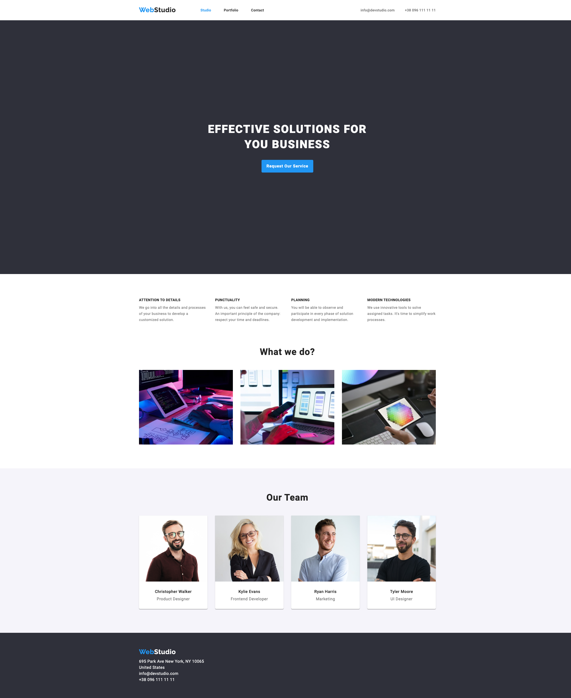

# HTML & CSS Project

Welcome to my HTML and CSS project repository! This project showcases my skills in front-end web development by creating a visually appealing and responsive web application.

## Features

- **Responsive Design**: Optimized for devices of all sizes, from desktops to mobile phones.
- **Semantic HTML**: Clean and organized structure using modern HTML5 practices.
- **Custom CSS Styling**: Unique styles created using CSS3, including animations and transitions.
- **Cross-Browser Compatibility**: Ensures the project looks great across all modern web browsers.

## Technologies Used

- **HTML5**: For the structure and content of the web pages.
- **CSS3**: For styling, animations, and layout designs.

## Installation

1. Clone this repository:

   ```bash
   git clone https://github.com/AndreiPaiuDev/webstudio.git
   ```

2. Open the project folder:

   ```bash
   cd html-css-project
   ```

3. Open `index.html` in your browser to view the project.

## Usage

Feel free to explore the code and use it as a starting point for your own projects. If you find this useful, please give it a star! ⭐

## Screenshots



## License

This project is licensed under the MIT License - see the [LICENSE](LICENSE) file for details.

## Contributing

Contributions are welcome! If you'd like to enhance this project, feel free to fork the repository and submit a pull request.

## Contact

If you have any questions or suggestions, feel free to reach out:

- Email: andreipaiudev@gmail.com
- GitHub: [AndreiPaiuDev](https://github.com/AndreiPaiuDev)